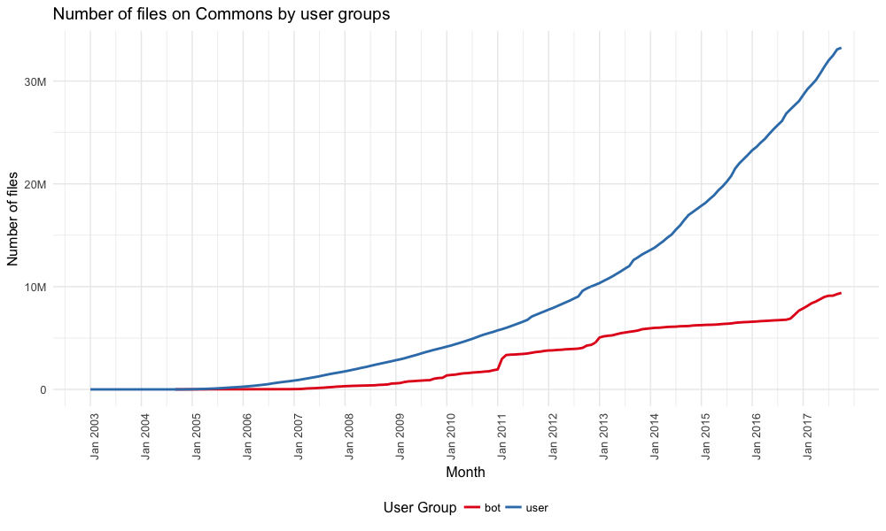
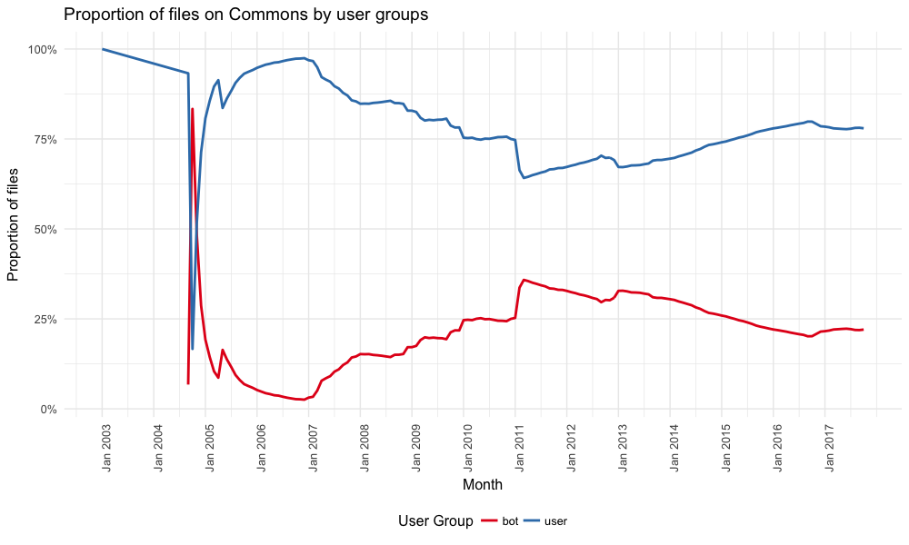

# Wikimedia Commons: Contributions by bots vs users

On Oct 12, 2017, the number of files uploaded by bots is 9,390,721 (22.03%), and the number of files uploaded by users is 33,241,541 (77.97%). The following table break down the counts by media type:

|Media Type |User Group |Number of Files|Proportion |
|:--------------|:----------|--------:|----------:|
|bitmap         |user       | 31355343|73.55%     |
|bitmap         |bot        |  8843447|20.74%     |
|drawing        |user       |   905964|2.13%      |
|drawing        |bot        |   270516|0.63%      |
|audio          |user       |   698566|1.64%      |
|audio          |bot        |    95646|0.22%      |
|video          |user       |    71738|0.17%      |
|video          |bot        |    36329|0.09%      |
|multimedia     |user       |        4|0%         |
|office         |user       |   209926|0.49%      |
|office         |bot        |   144783|0.34%      |

*Some bots are operated by institution, and some are tools like [Flickr upload bot](https://commons.wikimedia.org/wiki/User:Flickr_upload_bot).

The following two graphs breakdown the number by month:

