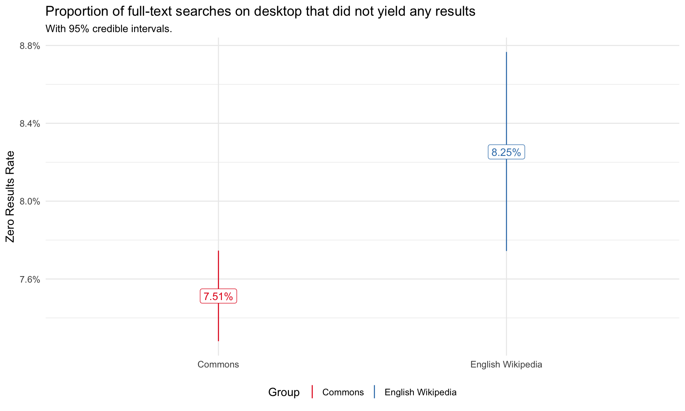
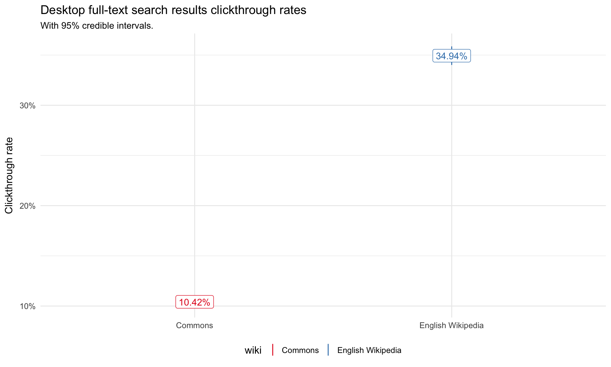

# Wikimedia Commons: Search metrics

We computed several search metrics with event logging data in November 2017, and compare them with English Wikipedia. They are searches on desktop, since we have very few searches on mobile web on Commons (less than 100 search result pages daily).

