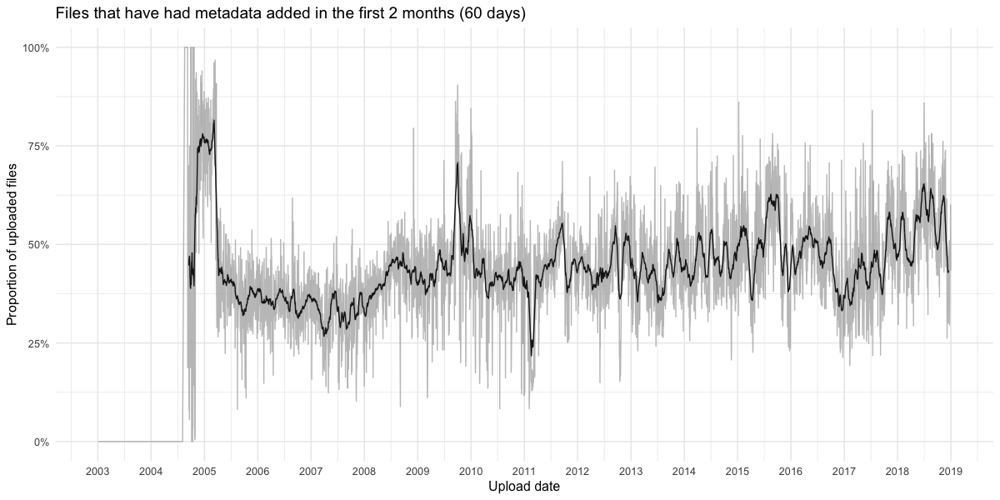

Daily data available in [data/snapshot_2018-12.csv](data/snapshot_2018-12.csv).

Posted in [T213597#4900741](https://phabricator.wikimedia.org/T213597#4900741):

- Using the December 2018 snapshot of [MediaWiki History in the Data Lake](https://wikitech.wikimedia.org/wiki/Analytics/Data_Lake/Edits/Mediawiki_history)
- Only files which have not been deleted are counted
- Only revisions to the metadata which were not reverted AND which were not reverts AND which were not deleted
- "Metadata augmented w/in 1st 2mo" means there was at least 1 byte-adding revision to the file's page within the first 60 days after creation

|Files since 2003 |Metadata augmented w/in 1st 2mo (60d) |Proportion |
|:----------------|:-------------------------------------|:----------|
|52,640,746       |24,003,593                            |45.599%    |

| Year|Files uploaded that year |Metadata augmented w/in 1st 2mo (60d) |Proportion |
|----:|:------------------------|:-------------------------------------|:----------|
| 2004|17,669                   |9,423                                 |53.331%    |
| 2005|265,976                  |108,449                               |40.774%    |
| 2006|648,025                  |228,230                               |35.219%    |
| 2007|1,205,884                |371,729                               |30.826%    |
| 2008|1,403,480                |576,987                               |41.111%    |
| 2009|1,927,836                |822,061                               |42.642%    |
| 2010|2,333,372                |863,588                               |37.010%    |
| 2011|3,884,635                |1,287,972                             |33.156%    |
| 2012|3,490,905                |1,589,173                             |45.523%    |
| 2013|4,591,272                |2,007,547                             |43.725%    |
| 2014|4,715,323                |2,215,437                             |46.984%    |
| 2015|5,683,966                |2,990,535                             |52.614%    |
| 2016|6,312,067                |2,921,214                             |46.280%    |
| 2017|8,182,236                |3,623,897                             |44.290%    |
| 2018|7,978,099                |4,387,351                             |54.992%    |

|Month          |Files uploaded that month |Metadata augmented w/in 1st 2mo (60d) |Proportion |
|:--------------|:-------------------------|:-------------------------------------|:----------|
|January 2018   |652,863                   |322,246                               |49.359%    |
|February 2018  |705,945                   |399,709                               |56.620%    |
|March 2018     |784,484                   |358,703                               |45.725%    |
|April 2018     |609,520                   |276,230                               |45.319%    |
|May 2018       |714,875                   |414,765                               |58.019%    |
|June 2018      |588,235                   |363,863                               |61.857%    |
|July 2018      |650,022                   |409,261                               |62.961%    |
|August 2018    |783,718                   |515,037                               |65.717%    |
|September 2018 |817,719                   |436,632                               |53.396%    |
|October 2018   |563,806                   |296,135                               |52.524%    |
|November 2018  |573,655                   |363,017                               |63.281%    |
|December 2018  |533,257                   |231,753                               |43.460%    |
